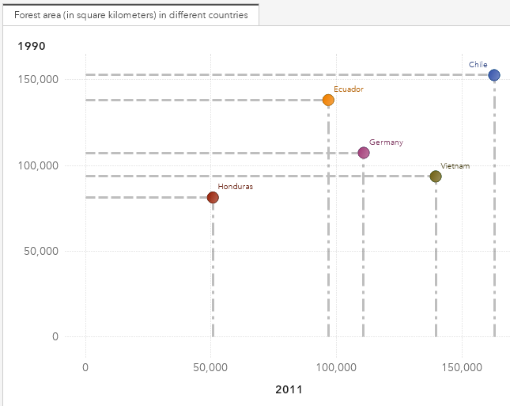

I think bubble plots are one of the best ways to show relationships between variables. However there are times when locations of the bubbles on the graph are so close together it's difficult to determine how close (or far apart) their associated data values are.  What would be nice is if we could get some bubble plot guidelines which assist in showing the values locations on the x and y axes. 

Well I have good news!  Turns out, in we can build a custom bubble plot where we can add these guidelines.  Take a look at the graph below which compares the amount of forest area (in square kilometers) in different countries for the years 1990 and 2011.  Notice how the faded dashed lines assist the report consumer in seeing the locations of the data values on the x and y axes.  Pretty neat!

Using this graph, it’s very easy to see not only where these data points are located within their respective data ranges, but also what their individual values are.

Data obtained from this [Curriculum Pathways Data Depot resource](https://www.curriculumpathways.com/portal/#!/info/2360?id=3001&keyword=forest&sourceid=56) and processed with SAS Visual Analytics 8.3.1.

This branch contains the needed resources to recreate this custom graph including:
* The code to which creates the final forest_area data set - forest_area_ETL.sas
* A JSON file containing the completed custom graph - BubblePlotGuidelines_CG.json
* A JSON file containing the completed report - BubblePlotGuidelines.json
