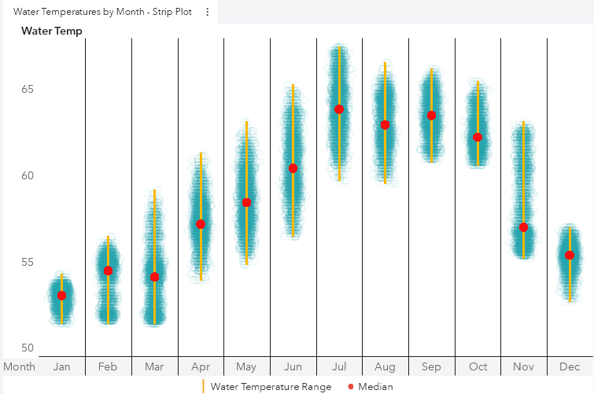

I recently was revisiting the data I used to build a monthly temperature comparison chart and was wondering if there might be another way to display this data's distribution.  After looking around a bit I ran across a type of graph I had never seen before known as a Strip Plot.  

I think these graphs are really cool!  Even though all the data points fall within one of the four categorical values on the X axis, by adding some random noise (or jitter) to the data, you can see the distribution of the data points along the graph's y axis.  So how do we create a similar graph that can be used in SAS Visual Analytics? Using the SAS Graph Builder builder of course!  I just a short time, I was able to create the following graph:

Get the details on the graph's source data and how to re-create this chart in this SAS Communities Library article

This directory contains the needed resources to recreate this custom graph including:

* A simulated data set of water temperatures - simulated_water_temps.sas7bdat
* The code to which creates the final water_temps_report data set - Strip_Plot_ETL.sas
* The completed output data set (sourced from the simulated data set) - waterTempStripPlot.sas7bdat
* A JSON file containing the completed custom graph - Strip_Plot_CG.json
* A JSON file containing the completed report - Strip_Plot.json
