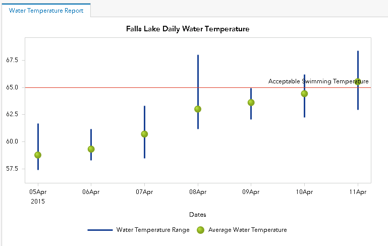

This graph demonstrates the ability to visualize a data range as a vector graph with the average interpolated as a bubble on the vector’s line.  Specifically, this example uses water temperature readings from the USGS Water Service as the report’s data source.

Get the details on the graph's source data and how to re-create this chart in this SAS Communities Library [article](https://communities.sas.com/t5/SAS-Communities-Library/Is-summer-over-already-Time-to-create-a-custom-vector-plot-in/ta-p/231253).  

This directory contains the needed resources to recreate this custom graph including:
* A simulated data set of water temperatures - simulated_falls_lake_water_temps.sas7bdat
* The code to which creates the final falls_lake_water_temps.sas7bdat data set - Temperature_Range_Vector_Plot_ETL.sas
* A JSON file containing the completed custom graph - Temperature_Range_Vector_Plot_83_CG.json
* A JSON file containing the completed report - Temperature_Range_Vector_Plot.json
* The original 7.2 package file from the article - Falls_Lake_Water_Temps.spk
