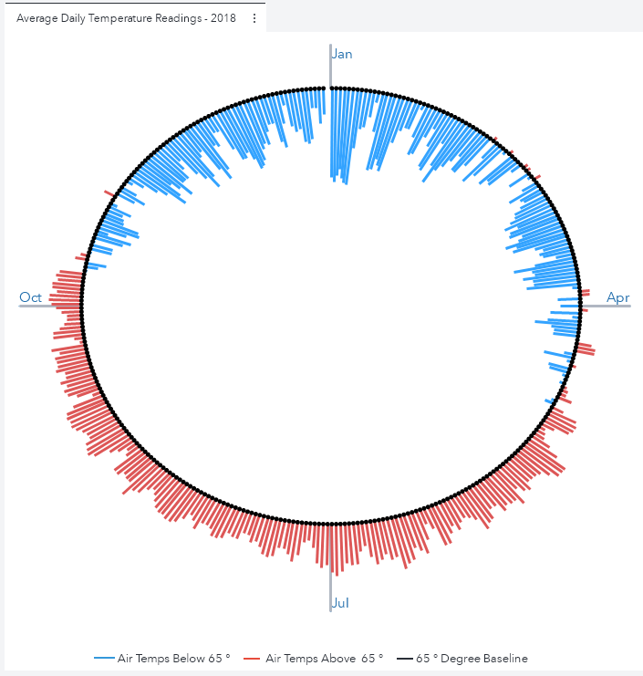

What you're ideal outdoor temperature to go for a jog?  For me, I think the best temperature to go running is 65 degrees Fahrenheit.  Ever since winter began I've been wondering: when are we are going to start seeing some 65 degree days?  This got me thinking, what's a good way to use SAS Visual Analytics to visualize average daily air temperatures throughout the 4 seasons of the year?  Specifically, how many days are above or below 65 degrees Fahrenheit? 

I began by opening the SAS Graph Builder and in just a few minutes, I was able to create the graph below. Each line represents the average air temperature for each day of the year.  The blue lines that extend inward represent days where the average temperature was BELOW than 65 degrees.  Conversely, the red lines that extend outward represent days where the average temperature was ABOVE 65 degrees.  The length of the lines represent the actual value of the average air temperature for each day.

This directory contains the needed resources to recreate this custom graph including:
* A simulated data set of air temperatures - simulatedairtemps.sas7bdat
* The code to which creates the final airTempCircleData data set - airTempCircleGraph_ETL.sas
* The completed output data set (sourced from the simulated data set) - airtempcircledata.sas7bdat
* A JSON file containing the completed custom graph - AirTempCircleGraph_CG.json
* A JSON file containing the completed report - AirTempCircleGraph.json
* The theme used to create the large text labels - AirCircleTheme.td
