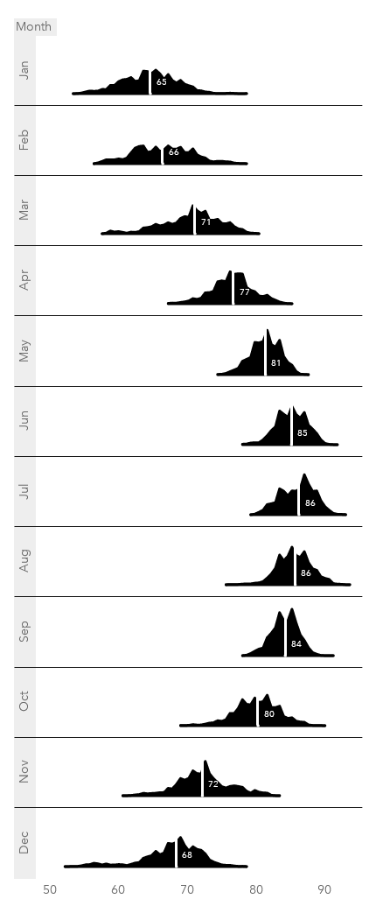

The ability to combine multiple graphs together to create new and unique visualizations is one of the many advantages to using custom graphs in SAS Visual Analytics report development.  The report below contains a custom graph first uses a band plot to display water temperature data stacked by month in lattice rows.  This band plot is then overlaid with both a vector and a series plot to display each month's median temperature in the form of a line and label.  Using this these three graphs together, it's very easy to see which months of the year are the warmest.

Get the details on the graph's source data and how to re-create this chart in this SAS Communities Library [article](https://communities.sas.com/t5/SAS-Communities-Library/How-to-create-a-butterfly-line-chart-in-SAS-Visual-Analytics/ta-p/489398).

This directory contains the needed resources to recreate this custom graph including:
* A simulated data set of water temperatures - simulated_water_temps.sas7bdat
* The code to which creates the final water_temps_report data set - water_temps_report_ETL.sas
* The completed output data set (sourced from the simulated data set) - water_temps_report.sas7bdat
* A JSON file containing the completed custom graph - Water_Temp_CG.json
* A JSON file containing the completed report - water_temps_report.json
